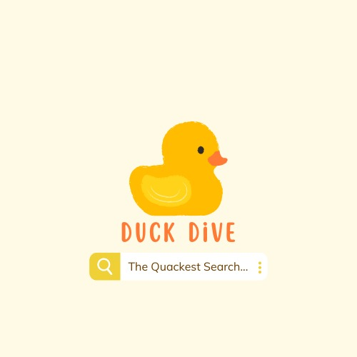

#  

<h1 align="center">
    🦆 DuckDive 🦆
</h1>

<h1 align="center">
    
    <br />
</h1>


A search engine that's quack-tastically different! Say goodbye to feeling like a  duck in a pond of info. We're here to help you find find what you're really quacking for.


# HOW TO RUN THE SEARCH ENGINE

## Prerequisites

- Java Development Kit (JDK) installed on your system
- Apache Maven installed on your system

## STEPS

1. **Clone the Repository**: 

```
    git clone https://github.com/shehab299/DuckDive.git
```

2. **Navigate to the Crawler Directory**

```
    cd DuckDive/SpiderDuck
```

3. **Build The Project**

```
    mvn clean install
```

4. **Run the Crawler**

```
    java -cp target/spider_duck-1.0-SNAPSHOT.jar com.crawler.App
```

5. **Build Other Components**


## Contribution GuideLines

